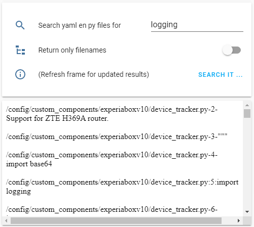

# ha-search4text
Home Assistant package to search for text in YAML and py files

This package was created specifically for the 'hide_entity' error, that does not show where it has found the entries, but I found it also useful for finding entities that I wanted to rename in the UI, but were linked to various automations, scripts and other places.

Tested on Home Assistant Core, version 0.107.

Installing:
- Put the yaml file in your packages folder.
- Put the lovelace file in your lovelace configuration.

Usage:
- Enter text in the input-box
- Click 'SEARCH IT...'
- Wait for a few seconds
- Right-click on the lower part of the windows and choose 'Refresh this frame', of whatever your browser calls it
- The search results will show up

The search results are grepped, with above and below three lines for context. The text output is converted to html and presented in a webframe card.

The search results will also be present in the /config folder of Home Assistant.

If you only want to see the files and not the contents, set the option 'Return only filenames' to 'on'.

Do you have a solution for the manual refresh problem, please let me know.
